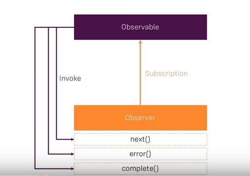

# rxjs-basics
Some devs have difficulties in understanding the concept of callbacks in RxJS. For this reason you will find two ways of creating Observables: the short way and the long way where everything is typed.

## Get started

Install Node.js and npm https://nodejs.org/en/ and check if the installation went well

```
node -v
```

```
npm -v
```

To run Typescript code need to install these packages https://www.npmjs.com/package/ts-node

```
npm install -g ts-node
```

```
npm install -g typescript
```

Then you can run the code by this

```
ts-node ./solutions/observable_with_types.ts
```

## What's good about Observables?

As each asynchronous datastream is wrapped around an Observable you always know how to handle every different datastream. You don't have multiple different implementations about it.

- http requests
- click events

## How do Observables, Observers and Subscriptions work together?

> Source: https://sites.google.com/site/debasish22blog/rxjs/observables-observers-and-subscriptions

### Observable
Wraps a stream that continuously emits data over data

### Observer 
The Observer is passed to Observable.subscribe(observer) as an callback. It executes a piece of code when invoked by the Observable.

The Observer has the following three methods: 
- next()
- error()
- complete()


